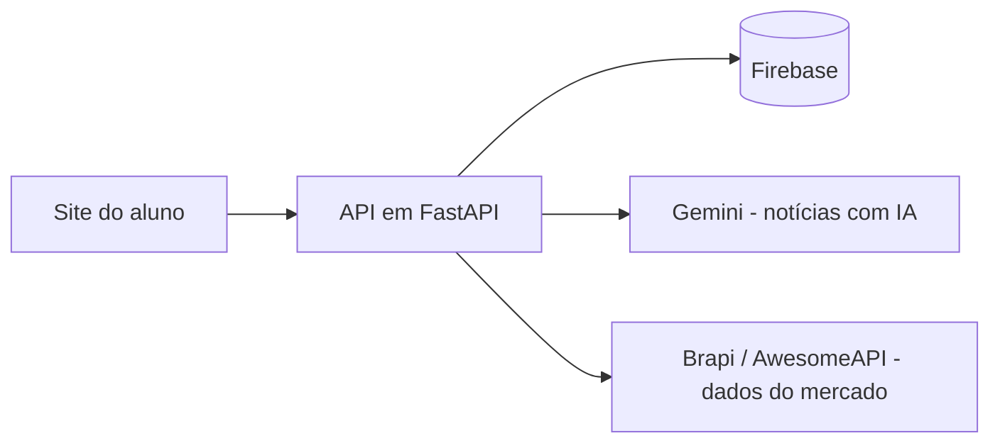

# 📈 TradeSim

**Plataforma web educacional de simulação de investimentos para escolas e universidades.**

O TradeSim permite que estudantes aprendam a investir na prática, comprando e vendendo ativos com dinheiro fictício, usando dados reais do mercado brasileiro. Tudo isso sem correr nenhum risco.

> 🚧 Projeto em desenvolvimento ativo. O código-fonte é privado, mas posso apresentar o projeto e o código em uma entrevista.

---

## 🎯 O problema

Muitos jovens terminam a escola e a faculdade sem nunca ter tido contato com investimentos. As plataformas das corretoras são feitas para quem já sabe investir: são confusas e não ensinam o básico.

O TradeSim resolve isso com um ambiente seguro, didático e com elementos de jogo, pensado para ser usado em sala de aula.

## ✨ Funcionalidades

- **Carteira de investimentos:** acompanha o preço médio de compra e o lucro ou prejuízo de cada ativo
- **Compra e venda simuladas** com dados reais do mercado brasileiro
- **Notícias geradas por IA**, que influenciam o mercado simulado
- **Motor de preços próprio**, que simula a variação dos ativos
- **Níveis de dificuldade:** Novato, Amador e Experiente
- **Login de usuários** e dados salvos na nuvem

## 🖼️ Telas

<!-- Arraste os prints aqui, um embaixo do outro -->

## 🛠️ Tecnologias

| Parte | Tecnologia |
|---|---|
| Backend (servidor) | Python + FastAPI |
| Banco de dados e login | Firebase (Firestore e Firebase Auth) |
| Inteligência artificial | Google Gemini |
| Dados de mercado | Brapi e AwesomeAPI |

## 🏗️ Como funciona

## 👤 Autor

**João**, estudante universitário interessado em mercado financeiro, produto e empreendedorismo em tecnologia.

- LinkedIn: _(seu link aqui)_
- E-mail: _(seu e-mail aqui)_
